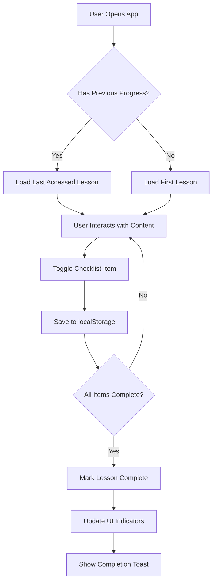

# Progress Tracking System - Current Status

## Overview
AI Academy currently uses a **localStorage-based progress tracking system** that operates entirely client-side. This document details the current implementation, limitations, and missing features.

## 1. Core Progress Data Structure

Located in `src/types/course.ts`:

```typescript
interface Progress {
  courseId: string;                           // Course identifier
  completedLessons: string[];                 // Array of completed lesson IDs
  checklistProgress: Record<string, string[]>; // lessonId → completed checklist item IDs
  lastAccessedLesson?: string;                // Most recently accessed lesson ID
  lastVideoTimestamp?: number;                // Video position in seconds (stored but unused)
  navigationHistory?: string[];               // Last 10 accessed lessons
}
```

## 2. Storage Implementation

### Location: `src/lib/progressStorage.ts`

#### Storage Mechanism
- **Storage Type**: Browser localStorage
- **Storage Key**: `course_progress` (single key for all data)
- **Persistence**: Client-side only
- **User Scope**: Browser-specific (not user-specific)

#### Core Functions

| Function | Purpose | Implementation Details |
|----------|---------|------------------------|
| `saveProgress()` | Persist progress to localStorage | Serializes Progress object to JSON |
| `loadProgress()` | Retrieve progress from localStorage | Returns default Progress if not found |
| `markLessonComplete()` | Mark a lesson as completed | Adds lesson ID to completedLessons array |
| `toggleChecklistItem()` | Toggle checklist item state | Updates checklistProgress record |
| `updateLastAccessedLesson()` | Track lesson navigation | Updates lastAccessedLesson and navigationHistory (max 10 items) |
| `getWeekProgress()` | Calculate week completion % | Returns completed/total lessons ratio |
| `getLessonProgress()` | Calculate lesson completion % | Currently binary (0 or 1) |

## 3. UI Components Using Progress

### CourseSidebar (`src/components/course/CourseSidebar.tsx`)
- **Visual Progress Indicators**:
  - Empty circle: Not started
  - Partial ring: In progress (conic gradient)
  - Green checkmark: Completed
- **Text Indicators**: "X/Y lessons completed"
- **Auto-expand**: First week expanded by default

### LessonContent (`src/components/course/LessonContent.tsx`)
- **Interactive Checklist**:
  - Square icon: Incomplete
  - CheckSquare icon: Complete
- **Auto-completion Logic**: All checklist items checked → lesson marked complete
- **Completion Toast**: "Lesson completed! 🎉"
- **Visual Badge**: Green "Lesson completed" indicator

### NavigationHeader (`src/components/navigation/NavigationHeader.tsx`)
- **Resume Button**: Uses `lastAccessedLesson` to continue where user left off
- **Quick Navigation**: Jump to last accessed content

### Index Page (`src/pages/Index.tsx`)
- **Auto-resume**: Loads last accessed lesson on app initialization
- **Progress Persistence**: Updates on every lesson change

## 4. Progress Tracking Flow



## 5. Current Limitations

### Critical Issues
1. **No User Association**: Progress tied to browser, not user account
2. **No Cloud Sync**: Different devices = different progress states
3. **Data Loss Risk**: Clearing browser data destroys all progress
4. **Single Course Support**: Hardcoded to one courseId
5. **No Backend Persistence**: Cannot recover lost progress

### Technical Limitations
- **Storage Size**: Limited by localStorage quota (~5-10MB)
- **No Versioning**: No migration strategy for data structure changes
- **No Validation**: Corrupted data could break the app
- **No Expiration**: Progress persists indefinitely
- **No Conflict Resolution**: Multiple tabs could cause data conflicts

### Missing User Features
- Cross-device synchronization
- Progress sharing/export
- Historical progress tracking
- Time-based analytics
- Completion certificates

## 6. Unused/Incomplete Features

### Video Timestamp Tracking
- `lastVideoTimestamp` field exists but is never:
  - Set when video is playing
  - Used to resume video position
  - Displayed in UI

### Navigation History
- Maintains last 10 accessed lessons
- Not exposed in UI
- Could power "recently viewed" feature

## 7. Missing Features for Production

### Essential Features
- [ ] **Database Integration**: Store progress in Supabase
- [ ] **User-specific Progress**: Link progress to authenticated users
- [ ] **Progress API**: REST endpoints for CRUD operations
- [ ] **Real-time Sync**: Update progress across devices/tabs
- [ ] **Data Migration**: Move localStorage data to database

### Analytics & Reporting
- [ ] Time spent per lesson
- [ ] Video watch percentage
- [ ] Quiz/assessment scores
- [ ] Learning path analytics
- [ ] Cohort progress comparison
- [ ] Instructor dashboard

### Gamification & Engagement
- [ ] Streaks tracking
- [ ] Points/badges system
- [ ] Leaderboards
- [ ] Progress milestones
- [ ] Completion certificates

### Advanced Features
- [ ] Offline support with sync
- [ ] Progress export (PDF/CSV)
- [ ] Learning recommendations
- [ ] Spaced repetition reminders
- [ ] Progress sharing on social media

## 8. Recommended Next Steps

### Phase 1: Database Integration (Priority: High)
1. Create Supabase tables for progress tracking
2. Implement progress API endpoints
3. Migrate localStorage data to database
4. Add real-time subscriptions

### Phase 2: Enhanced Tracking (Priority: Medium)
1. Implement video watch tracking
2. Add time spent analytics
3. Create progress dashboard
4. Add completion certificates

### Phase 3: Advanced Features (Priority: Low)
1. Add gamification elements
2. Implement social features
3. Create instructor analytics
4. Add AI-powered recommendations

## 9. Technical Debt

### Code Quality Issues
- No error boundaries for corrupted progress data
- No unit tests for progress functions
- Inconsistent progress update patterns
- Missing TypeScript strict mode

### Architecture Issues
- Tight coupling between UI and localStorage
- No abstraction layer for storage
- Missing progress service/context
- No progress event system

## Conclusion

The current progress tracking system is functional for MVP/demo purposes but requires significant enhancement for production use. The primary concern is the lack of server-side persistence, which makes it unsuitable for a multi-user, multi-device learning platform. Implementing database integration should be the top priority for improving the system.