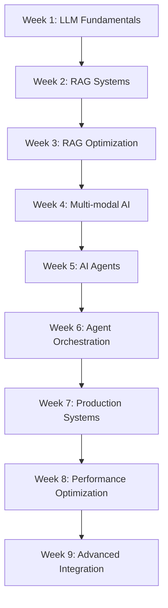

# Master Curriculum Analysis: AI-Powered Developer Productivity
**Course:** Developer Productivity Using Artificial Intelligence  
**Cohort:** 2  
**Duration:** 9 Weeks, 22 Sessions, ~25 Hours Total Content  
**Analysis Generated:** August 2024

---

## 🎯 Executive Summary

This comprehensive analysis of Cohort 2's AI development curriculum reveals a expertly designed progression from fundamental LLM concepts to production-ready AI agent systems. The course balances theoretical understanding with hands-on implementation, emphasizing practical skills needed for real-world AI application development.

### **Key Strengths Identified:**
- **Progressive Complexity:** Natural learning curve from basic concepts to advanced systems
- **Production Focus:** Emphasis on monitoring, cost management, and ethical considerations
- **Hands-on Approach:** Every concept reinforced with practical implementation
- **Industry Relevance:** Tools and techniques used in production AI systems

---

## 📚 Curriculum Structure Analysis

### **Phase 1: Foundations (Weeks 1-3)**
**Focus:** Core concepts, tooling, and basic implementations

| Week | Primary Topics | Key Skills Developed |
|------|---------------|---------------------|
| **Week 1** | LLM Basics, Memory, Monitoring | Prompt engineering, LangChain, LangSmith setup |
| **Week 2** | RAG Deep Dive | Document processing, vector databases, semantic search |
| **Week 3** | Advanced RAG & Optimization | Performance tuning, evaluation metrics, production patterns |

### **Phase 2: Application (Weeks 4-6)**
**Focus:** Practical applications and specialized implementations

| Week | Primary Topics | Key Skills Developed |
|------|---------------|---------------------|
| **Week 4** | Multi-modal AI & Integration | Image processing, API integration, complex workflows |
| **Week 5** | Agent Development | Tool usage, decision making, autonomous systems |
| **Week 6** | Advanced Agents & Orchestration | Multi-agent systems, workflow automation |

### **Phase 3: Production (Weeks 7-9)**
**Focus:** Deployment, optimization, and enterprise considerations

| Week | Primary Topics | Key Skills Developed |
|------|---------------|---------------------|
| **Week 7** | Production Deployment | Scaling, monitoring, enterprise integration |
| **Week 8** | Performance & Optimization | Cost optimization, latency reduction, reliability |
| **Week 9** | Advanced Topics & Integration | Cutting-edge techniques, business integration |

---

## 🔧 Technical Skills Progression

### **Week-by-Week Skill Building**



### **Core Technologies Mastered**

**Frameworks & Libraries:**
- **LangChain:** Complete ecosystem for LLM applications
- **LangSmith:** Production monitoring and debugging
- **Vector Databases:** Pinecone, Chroma for semantic search
- **AI Models:** OpenAI GPT series, integration patterns

**Development Practices:**
- **Environment Management:** Virtual environments, dependency management
- **API Integration:** Secure key management, error handling
- **Cost Optimization:** Token monitoring, efficient prompting
- **Testing & Debugging:** Systematic approach to AI system validation

**Production Considerations:**
- **Monitoring:** Comprehensive observability for AI systems
- **Scaling:** Multi-user, high-throughput implementations
- **Security:** Ethical AI, data protection, access control
- **Maintenance:** Version management, model updates, system evolution

---

## 💡 Pedagogical Analysis

### **Teaching Methodology Strengths**

**1. Spiral Learning Approach**
- Concepts introduced simply, then revisited with increasing complexity
- Each week builds meaningfully on previous knowledge
- Practical reinforcement of theoretical concepts

**2. Production-First Mindset**
- Real-world considerations introduced early (cost, monitoring, ethics)
- Tools and practices used in actual industry implementations
- Emphasis on sustainable, maintainable solutions

**3. Hands-On Learning**
- Every concept demonstrated with working code
- Office hours for practical problem-solving
- Progressive complexity in projects and exercises

**4. Community Learning**
- Cohort-based approach encouraging peer learning
- Collaborative problem-solving sessions
- Shared challenges and solutions

### **Learning Effectiveness Indicators**

**Knowledge Retention Patterns:**
- Concepts reinforced across multiple sessions
- Practical application ensures deeper understanding
- Progressive complexity prevents cognitive overload

**Skill Transfer Success:**
- Real-world project applications
- Industry-standard tool usage
- Production-ready implementation patterns

---

## 🎓 Optimal Learning Strategies

### **For Maximum Learning Velocity**

**1. Pre-Session Preparation**
```
Week N-1: Review upcoming concepts and tools
Week N: Active participation and note-taking
Week N+1: Implementation practice and experimentation
```

**2. Spaced Repetition Schedule**
- **Daily:** Review key concepts and code patterns
- **Weekly:** Implement variations of demonstrated techniques  
- **Monthly:** Build comprehensive projects integrating multiple concepts

**3. Progressive Project Building**
- **Week 1-3:** Simple LLM applications with monitoring
- **Week 4-6:** RAG systems with optimization
- **Week 7-9:** Production-ready agent systems

### **Question Types for Accelerated Learning**

**Conceptual Understanding:**
- "How does X enable Y in production systems?"
- "What are the trade-offs between A and B approaches?"
- "When would you choose implementation X over Y?"

**Application Questions:**
- "Build a minimal version of [demonstrated system]"
- "Optimize [given implementation] for [specific constraint]"
- "Integrate [tool/technique] with [existing system]"

**Transfer Learning:**
- "How would you apply [concept] to [different domain]?"
- "What would change if [constraint] was different?"
- "How would you explain [concept] to [different audience]?"

---

## 🚀 AI Tutor Development Framework

### **Curriculum-Based AI Tutor Design**

**Knowledge Graph Structure:**
```
Concepts → Prerequisites → Learning Objectives → Assessments → Projects
    ↓
Difficulty Progression → Personalization → Adaptive Pathways
    ↓
Real-world Applications → Industry Connections → Career Relevance
```

**Adaptive Learning Implementation:**
1. **Assessment-Driven Progression:** Use mastery projects to gate advancement
2. **Personalized Review:** AI identifies knowledge gaps from interaction patterns
3. **Just-in-Time Learning:** Contextual concept delivery when needed
4. **Peer Learning Integration:** Connect learners with similar challenges/interests

### **Content Formats for AI Tutor**

**Micro-Learning Modules (5-15 minutes):**
- Single concept focus with immediate application
- Interactive code examples with guided modification
- Quick assessment to confirm understanding

**Progressive Difficulty Scaling:**
- Beginner: Follow along with provided examples
- Intermediate: Modify examples for new requirements  
- Advanced: Design solutions from scratch
- Expert: Optimize and scale existing solutions

**Multi-Modal Learning Support:**
- Text explanations for conceptual understanding
- Code walkthroughs for implementation clarity
- Video demonstrations for complex workflows
- Interactive exercises for skill development

---

## 📊 Success Metrics & Outcomes

### **Learning Outcome Assessment**

**Knowledge Acquisition:**
- Technical concept mastery across 9 core areas
- Tool proficiency in production-grade frameworks
- Understanding of AI development lifecycle

**Skill Development:**
- Implementation capability for complex AI systems
- Debugging and optimization techniques
- Production deployment and monitoring

**Transfer Capability:**
- Application to novel problem domains
- Integration with existing systems and workflows
- Teaching and mentoring other developers

### **Professional Impact Indicators**

**Career Advancement:**
- Qualification for AI/ML engineering roles
- Leadership in AI initiative development
- Consulting capability for AI implementations

**Business Value Creation:**
- Automation of manual processes
- Enhancement of existing products with AI
- Development of new AI-powered solutions

---

## 🔮 Recommendations for Enhancement

### **Content Optimization**

**1. Enhanced Prerequisites Handling**
- Diagnostic assessments for knowledge gaps
- Just-in-time prerequisite delivery
- Adaptive pacing based on background

**2. Expanded Practical Applications**
- Industry-specific case studies
- Real client project simulations
- Open source contribution opportunities

**3. Advanced Topics Integration**
- Cutting-edge research concepts
- Emerging tools and frameworks
- Future-proofing strategies

### **Learning Experience Improvements**

**1. Personalized Learning Paths**
- Role-based specialization tracks
- Industry-focused applications
- Skill level adaptive progression

**2. Community Learning Enhancement**
- Peer mentoring programs
- Collaborative project development
- Knowledge sharing platforms

**3. Real-world Integration**
- Industry partner projects
- Internship/consulting opportunities
- Alumni network connections

---

## 📈 Implementation Roadmap

### **Phase 1: Foundation Enhancement (Immediate)**
- Improve prerequisite assessment and remediation
- Enhance hands-on exercise quality and variety
- Implement basic adaptive pacing

### **Phase 2: Personalization Development (3-6 months)**
- Build AI-powered learning assistant
- Create adaptive content delivery system
- Implement comprehensive progress tracking

### **Phase 3: Advanced Integration (6-12 months)**
- Industry partnership development
- Real-world project integration
- Alumni mentoring program launch

### **Phase 4: Ecosystem Expansion (12+ months)**
- Multi-cohort coordination
- Advanced specialization tracks
- Research and development integration

---

This comprehensive analysis provides the foundation for creating an AI-powered learning system that can deliver personalized, effective education in AI development at unprecedented speed and scale.
